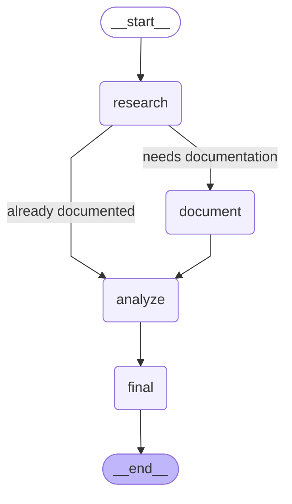

# Self-Documentation Agent System

A streamlined LangGraph workflow that automatically analyzes, documents, and validates Python code. This system uses a simplified three-node architecture to provide comprehensive code documentation and analysis with professional output formatting.

## Features

- **Simplified Three-Node Workflow**: Research → Document → Analyze with conditional flow
- **Intelligent Documentation Detection**: Automatically skips documentation if already present
- **Comprehensive Code Documentation**: Generates detailed docstrings, inline comments, and warnings
- **Automated Code Testing**: Executes code with various test scenarios and captures I/O behavior
- **Professional Output**: Clean, business-appropriate formatting without excessive emojis
- **Workflow Visualization**: Automatically generates workflow diagrams (PNG/Mermaid)
- **File-Based Results**: Saves documented code to `code.py` and analysis to `analysis.txt`

## Workflow

The system follows a simplified three-node workflow with conditional logic:



### Node Functions

1. **Research Node**:
   - Analyzes code structure and identifies libraries
   - Checks if documentation already exists
   - Uses agent with search tools for library research
   - Conditionally routes to documentation or analysis

2. **Document Node**:
   - Adds comprehensive docstrings using Google style
   - Inserts inline comments for complex logic
   - Flags potential issues with warning comments
   - Uses model directly (no agent needed)

3. **Analyze Node**:
   - Executes code with various test scenarios
   - Identifies syntax errors, logic issues, and potential problems
   - Documents detailed input/output behavior
   - Uses agent with code execution tools

4. **Final Node**:
   - Saves documented code to `code.py`
   - Saves analysis results to `analysis.txt`
   - Provides workflow completion summary

## Installation

### Prerequisites

- Python 3.8+
- Virtual environment (recommended)

### Setup

1. **Clone or download the project files**

2. **Create and activate a virtual environment**:
   ```bash
   python3 -m venv venv
   source venv/bin/activate  # On Windows: venv\Scripts\activate
   ```

3. **Install dependencies**:
   ```bash
   pip install -r requirements.txt
   ```

4. **Set up environment variables**:
   Create a `.env` file and add your API keys:
   ```bash
   GOOGLE_API_KEY=your_google_api_key_here
   TAVILY_API_KEY=your_tavily_api_key_here
   ```

## Configuration

### API Keys Required

- **Google API Key**: For Gemini 2.5 Flash model access
- **Tavily API Key**: For web search functionality during library research

### Prompts Configuration

The system uses YAML-based prompt configuration stored in `prompts.yaml`. You can customize the behavior of each node by modifying their respective prompts:

```yaml
research_prompt: |
  You are a Code Research Specialist. Analyze the provided Python code and:
  1. Check if the code already has documentation (docstrings, comments)
  2. Identify all imported libraries and understand their purpose
  3. Understand what the code does and what kind of tests would be appropriate
  4. Research any unfamiliar libraries using the search tool

document_prompt: |
  You are a Documentation Generator. Add comprehensive documentation to the code:
  1. Add clear docstrings to all functions and classes using Google style
  2. Add single-line comments for complex logic, algorithms, and important steps
  3. Flag any potential syntax issues or logic problems with # WARNING: comments
  4. Add comments explaining the purpose of key variables and data structures

analyze_prompt: |
  You are a Code Analyzer and Tester. Perform comprehensive analysis:
  1. Execute the code with the provided examples
  2. Test edge cases and boundary conditions
  3. Try different input scenarios (valid, invalid, edge cases)
  4. Identify syntax errors, logic issues, performance concerns, and security risks
  5. Document detailed input/output behavior with examples
```

## Usage

### Basic Usage

Run the main script to process the example code:

```bash
source venv/bin/activate  # Activate virtual environment
python main.py
```

### Custom Code Analysis

To analyze your own code, modify the `sample_code` variable in `main.py`:

```python
# Replace the sample_code variable with your code
sample_code = """
# Your Python code here
import your_library

def your_function():
    pass
"""
```

### Workflow Visualization

The system automatically generates workflow diagrams:

- **PNG format**: `workflow_diagram.png` (primary format)
- **Mermaid format**: `workflow_diagram.mmd` (fallback if PNG fails)

## Project Structure

```
SelfDocumentation/
├── main.py                 # Main application script
├── prompts.yaml           # Node prompts configuration
├── requirements.txt       # Python dependencies
├── .env                  # Environment variables (API keys)
├── README.md             # This documentation
├── code.py               # Generated documented code (output)
├── analysis.txt          # Generated analysis results (output)
├── workflow_diagram.png  # Generated workflow diagram
├── workflow_diagram.mmd  # Mermaid diagram (fallback)
└── venv/                 # Virtual environment
```

## Output Files

The system generates two main output files:

### `code.py` - Documented Code
Contains the original code enhanced with:
- **Comprehensive docstrings** using Google style format
- **Inline comments** explaining complex logic and calculations
- **Warning comments** flagging potential issues (e.g., `# WARNING: Division by zero risk`)
- **Implementation notes** for important details

### `analysis.txt` - Analysis Results
Contains structured analysis including:
- **Libraries Used**: All identified imports and dependencies
- **Issues and Recommendations**: Potential problems and improvement suggestions
- **Test Results and I/O Behavior**: Detailed execution results with various inputs
- **Usage Guidelines**: Instructions for implementing and testing the code

### Example Output Structure

```python
# From code.py
def divide_numbers(a, b):
    """
    Divides two numbers.

    Args:
        a (int or float): The numerator.
        b (int or float): The denominator.

    Returns:
        float: The result of the division.

    Raises:
        ZeroDivisionError: If the denominator 'b' is zero.
    """
    # WARNING: This function will raise a ZeroDivisionError if 'b' is 0
    return a / b
```

## Dependencies

### Core Dependencies

- `langgraph`: Workflow orchestration and state management
- `langchain`: LLM framework and tools
- `langchain-google-genai`: Google Gemini 2.5 Flash integration
- `langchain-community`: Community tools and integrations
- `langchain-experimental`: Code execution tools
- `tavily-python`: Web search functionality for library research
- `python-dotenv`: Environment variable management
- `PyYAML`: YAML configuration parsing

### Optional Dependencies

- Visualization libraries for workflow diagram generation (automatically handled)

## Workflow Execution Example

```bash
$ python main.py

Starting Documentation Workflow
==================================================

Step: RESEARCH
------------------------------
RESEARCH: Analyzing code structure and documentation...
  - Libraries found: ['math', 'random']
  - Documentation present: False
  - Code requires documentation

Step: DOCUMENT
------------------------------
DOCUMENT: Adding documentation and comments...
  - Documentation completed

Step: ANALYZE
------------------------------
ANALYZE: Testing code and identifying issues...
  - Issues found: 2
  - Test results captured: 1

Step: FINAL
------------------------------
FINALIZE: Saving results to files...
  - Documented code saved to code.py
  - Analysis results saved to analysis.txt
Workflow diagram saved as workflow_diagram.png

==================================================
WORKFLOW SUMMARY
==================================================
Status: completed
Libraries: 2
Issues: 2
Tests: 1

Workflow completed successfully!
Output files:
  - code.py: Documented code
  - analysis.txt: Analysis results
```

## Troubleshooting

### Common Issues

1. **API Key Errors**: Ensure your Google and Tavily API keys are correctly set in the `.env` file
2. **Visualization Issues**: If PNG generation fails, the system will fallback to Mermaid text format
3. **Import Errors**: Make sure all dependencies are installed in your virtual environment
4. **Empty Output Files**: Check that the workflow completed successfully and API keys are valid

### Support

For issues and questions, please check the documentation or create an issue in the project repository.

---

*Built with LangGraph and LangChain for streamlined code documentation automation.*
